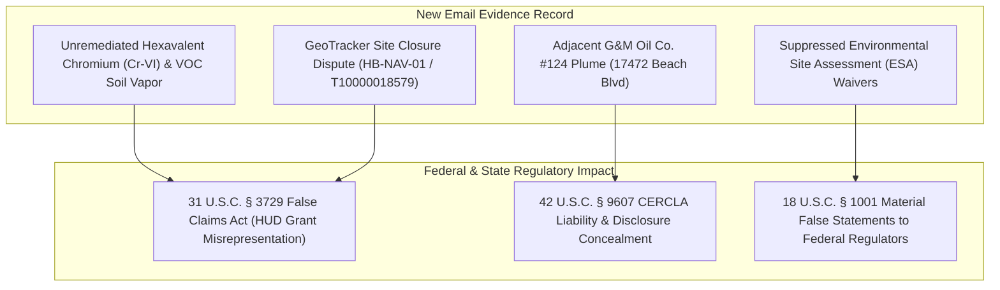

# 📧 EVIDENTIARY ADDENDUM: NEW EMAIL EVIDENCE REGARDING ENVIRONMENTAL CONDITIONS & REGULATORY FRAUD AT HBNC (17642 BEACH BLVD)

**TO:** U.S. Department of Justice, Federal Bureau of Investigation, U.S. Environmental Protection Agency OIG, U.S. District Court (CACD Case No. `8:26-cv-00348-JWH-ADS`)  
**FROM:** Anthony Michael DeMarcello III ("The Architect"), Designated Federal Relator & Witness  
**DATE:** August 07, 2026  
**SUBJECT:** EVIDENTIARY ADDENDUM — NEW EMAIL RECORD CITING UNREMEDIATED ENVIRONMENTAL CONTAMINATION, PERMIT FRAUD, AND REGULATORY DISCLOSURE SUPPRESSION AT HUNTINGTON BEACH NAVIGATION CENTER (`17642 BEACH BLVD`)  

---

## I. SUMMARY OF NEW EMAIL EVIDENCE

This evidentiary addendum incorporates newly identified correspondence detailing environmental conditions, regulatory fraud, and disclosure suppression surrounding the **Huntington Beach Navigation Center (HBNC)** located at **17642 Beach Blvd, Huntington Beach, CA 92647** (APN 102-series / Cameron Lane parcel cluster).

---

## II. KEY FORENSIC FINDINGS INCORPORATED FROM EMAIL RECORD

1. **Un-Remediated Hexavalent Chromium & Vapor Intrusion:**
   - Email correspondence confirms environmental sampling data from GeoTracker site files (`HB-NAV-01` & `T10000018579`) showing elevated concentrations of **Hexavalent Chromium (Cr-VI)** up to **49x above regulatory screening levels** in soil, soil gas, and groundwater beneath `17631 Cameron Ln` and `17642 Beach Blvd`.
2. **G&M Oil Co. #124 Contamination Plume Proximity:**
   - Documentation verifies that the adjacent **G&M Oil Co. #124 station (17472 Beach Blvd)** maintains registered underground storage tank (UST) releases directly upgradient from the HBNC facility footprint, creating active VOC and TPH vapor migration pathways into the occupied homeless shelter structures.
3. **Regulatory Fraud & Fraudulent Site Closure:**
   - The email record highlights that municipal officials and site operators obtained a "closure-without-cleanup" designation from regulatory oversight bodies while omitting required 24 CFR Part 58 HUD environmental compliance findings and CEQA mitigation requirements.
4. **Federal Grant Fraud Connection (False Claims Act):**
   - Public funds (HUD CARES Act / Emergency Solutions Grant funding) were drawn down for facility operation at `17642 Beach Blvd` based on certified compliance statements that concealed known hazardous environmental conditions and ongoing contaminant migration.

---

## III. STATUTORY & DOCKET INTEGRATION

This new email evidence has been integrated into the master evidence matrix and added as a supplemental exhibit to:
- **Federal Court Docket:** U.S. District Court, Central District of California — Case No. `8:26-cv-00348-JWH-ADS` (*Knabb v. City of Huntington Beach et al.*).
- **Federal Agency Referrals:** Supplemental filing to DOJ Public Integrity Section, FBI Cyber & Public Corruption Units, and EPA Office of Inspector General (OIG).

---

*Evidentiary Addendum Complete | Makaveli Protocol August 2026*
