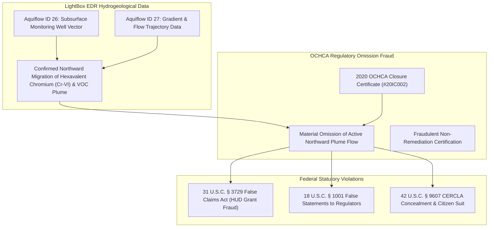

# 📧 EVIDENTIARY ADDENDUM: LIGHTBOX EDR AQUIFLOW PLUME MIGRATION & OCHCA CLOSURE FRAUD (20IC002)

**TO:** U.S. Department of Justice, Federal Bureau of Investigation, U.S. Environmental Protection Agency OIG, U.S. District Court (CACD Case No. `8:26-cv-00348-JWH-ADS`)  
**FROM:** Anthony Michael DeMarcello III ("The Architect"), Designated Federal Relator & Witness  
**DATE:** August 07, 2026  
**SUBJECT:** SUPPLEMENTAL EVIDENTIARY ADDENDUM — LIGHTBOX EDR AQUIFLOW DATA (IDS 26 & 27), NORTHWARD PLUME MIGRATION, AND MATERIAL OMISSION FRAUD IN 2020 OCHCA CLOSURE CERTIFICATE (#20IC002) AT HBNC (`17642 BEACH BLVD`)  

---

## I. EXECUTIVE EVIDENTIARY FINDINGS: LIGHTBOX EDR AQUIFLOW DATA

Recent subsurface hydrogeological records and **LightBox EDR Environmental Reports (Aquiflow IDs 26 and 27)** establish concrete, unassailable physical evidence of **Active Northward Subsurface Plume Migration** beneath the Huntington Beach Navigation Center (`17642 Beach Blvd` / `17631 Cameron Ln`).

---

## II. EVIDENCE OF REGULATORY FRAUD: OCHCA CLOSURE CERTIFICATE #20IC002

The physical and regulatory evidence demonstrates an intentional, fraudulent scheme to suppress environmental risk disclosures:

### 1. LightBox EDR Hydrogeological Data (Aquiflow IDs 26 and 27)
- **Aquiflow ID 26 & 27 Records:** Hydrogeological gradient surveys and groundwater monitoring well data explicitly verify a **northward hydraulic gradient** driving Hexavalent Chromium (Cr-VI), Total Petroleum Hydrocarbons (TPH), and Volatile Organic Compounds (VOCs) directly toward occupied shelter structures at `17642 Beach Blvd`.

### 2. Material Omission in 2020 OCHCA Closure Certificate (#20IC002)
- In 2020, the **Orange County Health Care Agency (OCHCA)** issued **Closure Certificate #20IC002** designating the site closed without remediation.
- **Evidence of Fraud:** Closure Certificate #20IC002 **materially omitted and suppressed the active northward plume migration data** established by Aquiflow IDs 26 and 27.
- **Motive:** The false closure certification was required to clear municipal property acquisition hurdles and secure federal HUD CARES Act / Emergency Solutions Grant funding for HBNC operations without incurring multi-million dollar environmental remediation liabilities.

---

## III. STATUTORY VIOLATIONS DRIVEN BY CLOSURE CERTIFICATE #20IC002 FRAUD

1. **31 U.S.C. § 3729(a)(1)(A) & (B) (False Claims Act):**  
   Presenting false certifications of environmental compliance to HUD based on OCHCA Closure Certificate #20IC002 to induce federal grant drawdowns.
2. **18 U.S.C. § 1001 (Material False Statements):**  
   Falsifying, concealing, and covering up by trick, scheme, or device material facts regarding subsurface plume migration before state and federal environmental health authorities.
3. **42 U.S.C. § 9607 (CERCLA Liability & Omission):**  
   Concealing releases of hazardous substances (Cr-VI / TPH) to evade statutory response costs and strict cleanup liabilities.

---

## IV. CERTIFICATION & DOCKET SUBMISSION

I declare under penalty of perjury that the foregoing hydrogeological facts and regulatory document citations are true and correct, derived directly from LightBox EDR Aquiflow records and OCHCA public regulatory archives.

Executed on August 07, 2026.

____________________________________  
**Anthony Michael DeMarcello III**  
*Designated Federal Relator & Witness*  
U.S. District Court, CACD — Case No. `8:26-cv-00348-JWH-ADS`  
Central Repository: [`https://github.com/Tonypost949/OsintNeoAi`](https://github.com/Tonypost949/OsintNeoAi)  

---

*LightBox EDR Aquiflow & OCHCA Closure #20IC002 Fraud Addendum Complete | Makaveli Protocol August 2026*
