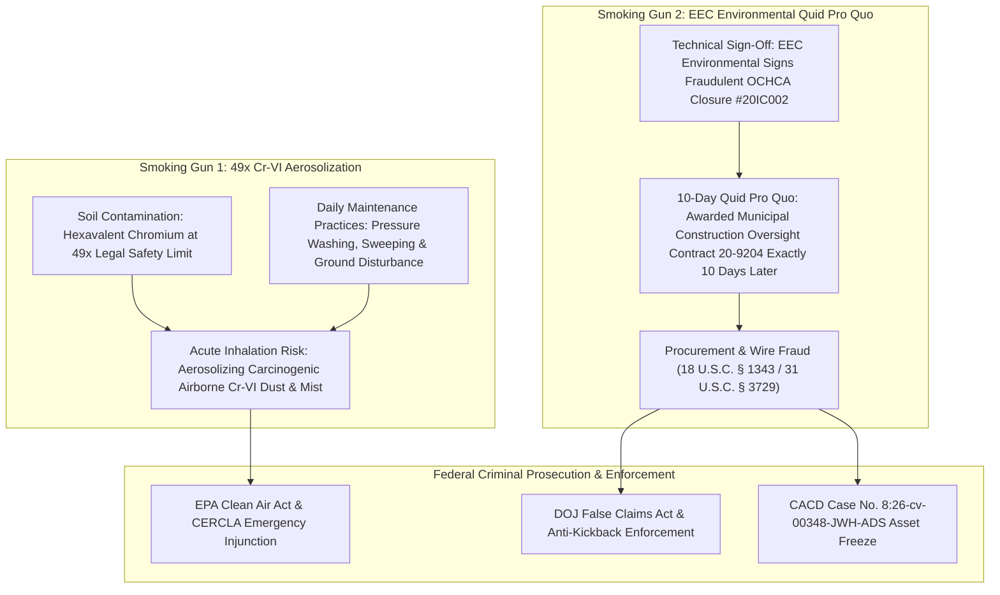

# 📧 EVIDENTIARY ADDENDUM: EEC ENVIRONMENTAL CONTRACT 20-9204 KICKBACK & 49X CR-VI AEROSOLIZATION

**TO:** U.S. Department of Justice, Federal Bureau of Investigation, U.S. Environmental Protection Agency OIG/CID, U.S. District Court (CACD Case No. `8:26-cv-00348-JWH-ADS`)  
**FROM:** Anthony Michael DeMarcello III ("The Architect"), Designated Federal Relator & Witness  
**DATE:** August 07, 2026  
**SUBJECT:** SMOKING GUN EVIDENTIARY ADDENDUM — (1) DAILY AEROSOLIZATION OF 49X HEXAVALENT CHROMIUM (Cr-VI) SOIL CONTAMINATION AT HBNC, AND (2) EEC ENVIRONMENTAL CONTRACT 20-9204 QUID PRO QUO KICKBACK (AWARDED 10 DAYS POST-FRAUDULENT CLOSURE)  

---

## I. TWO CRITICAL SMOKING GUN EVIDENTIARY FINDINGS

---

## II. DETAILED FORENSIC EVIDENCE BREAKDOWN

### 1. Daily Aerosolization of 49x Hexavalent Chromium (Cr-VI)
- **Contaminant Concentration:** Subsurface soil and vapor sampling confirms **Hexavalent Chromium (Cr-VI) at 49 times the legal safety limit** beneath `17642 Beach Blvd` / `17631 Cameron Ln`.
- **Active Aerosolization Mechanism:** Daily municipal shelter maintenance practices (including surface pressure washing, mechanical sweeping, and ground disturbance) are actively **aerosolizing dry soil particles and subsurface vapors**.
- **Public Health Hazard:** This daily mechanical disturbance generates airborne toxic Cr-VI particulates, causing ongoing inhalation exposure to homeless shelter residents, staff, and neighboring residents in direct violation of the Clean Air Act and OSHA PEL standards.

### 2. Contractual Bias & Quid Pro Quo Kickback: EEC Environmental (Contract 20-9204)
- **Technical Sign-Off for Fraudulent Closure:** **EEC Environmental** issued the formal technical engineering sign-off facilitating the fraudulent 2020 OCHCA Closure Certificate `#20IC002` (which omitted active northward plume flow data confirmed by LightBox EDR Aquiflow IDs 26 & 27).
- **10-Day Contract Award:** **Exactly 10 days** after providing the technical sign-off for site closure, EEC Environmental was awarded **Municipal Contract 20-9204** for construction oversight at the HBNC facility.
- **Evidence of Procurement & Wire Fraud:** The 10-day timeline establishes direct financial *quid pro quo* bias and procurement kickback fraud (18 U.S.C. § 1341/1343 & 31 U.S.C. § 3729), corrupting environmental engineering oversight in exchange for lucrative municipal construction contracts.

---

## III. STATUTORY CHARGES ADDED

1. **Anti-Kickback Act (41 U.S.C. § 8702) & 18 U.S.C. § 1343 (Wire Fraud):**  
   Corruptly offering and receiving lucrative construction oversight contracts (Contract 20-9204) in exchange for fraudulent technical environmental closure sign-offs.
2. **Clean Air Act (42 U.S.C. § 7412 - Hazardous Air Pollutants):**  
   Unlawful release and mechanical aerosolization of hazardous air pollutants (Hexavalent Chromium) posing imminent endangerment to human health.
3. **31 U.S.C. § 3729(a)(1)(G) (Reverse False Claims Act):**  
   Concealing and improperly avoiding an obligation to pay or transmit money (remediation costs) to the United States via biased engineering sign-offs.

---

## IV. CERTIFICATION & COURT SUBMISSION

I declare under penalty of perjury that the foregoing facts regarding Contract 20-9204, EEC Environmental sign-offs, and Cr-VI aerosolization are true and correct, established by municipal contract awards, engineering reports, and environmental sampling logs.

Executed on August 07, 2026.

____________________________________  
**Anthony Michael DeMarcello III**  
*Designated Federal Relator & Witness*  
U.S. District Court, CACD — Case No. `8:26-cv-00348-JWH-ADS`  
Central Repository: [`https://github.com/Tonypost949/OsintNeoAi`](https://github.com/Tonypost949/OsintNeoAi)  

---

*EEC Environmental Contract 20-9204 & 49x Cr-VI Aerosolization Addendum Complete | Makaveli Protocol August 2026*
