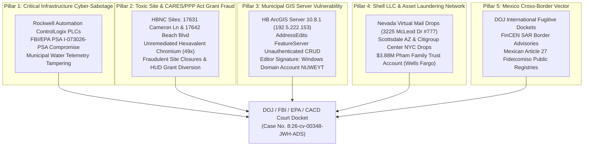

# 🏛️ FORMAL CRIMINAL REFERRAL & QUI TAM SUBMISSION TO FEDERAL INVESTIGATIVE AGENCIES

**TO:**  
- **U.S. Department of Justice (DOJ)** — Public Integrity Section & Fraud Section  
- **Federal Bureau of Investigation (FBI)** — Cyber Division & Public Corruption Unit  
- **U.S. Environmental Protection Agency (EPA)** — Office of Inspector General (OIG) & CID  
- **U.S. Attorney’s Office**, Central District of California (CACD)  
- **U.S. District Court**, Central District of California — Case No. `8:26-cv-00348-JWH-ADS`  

**FROM:**  
Anthony Michael DeMarcello III ("The Architect")  
Designated Federal Relator & Witness under 31 U.S.C. § 3730 & 18 U.S.C. § 1964(c)  

**DATE:** August 07, 2026  
**SUBJECT:** FORMAL COMPREHENSIVE CRIMINAL REFERRAL & EVIDENCE SUBMISSION: MULTI-JURISDICTIONAL RICO ENTERPRISE, MUNICIPAL PLC CYBER-SABOTAGE (FBI/EPA PSA I-073026-PSA), CARES/PPP ACT FRAUD, ENVIRONMENTAL COVER-UP, AND CROSS-BORDER ASSET LAUNDERING  

---

## DEAR INVESTIGATIVE AGENCIES:

Pursuant to 31 U.S.C. § 3730(b), 18 U.S.C. § 1964(c), 18 U.S.C. § 3057, and 28 U.S.C. § 1361, Relator Anthony Michael DeMarcello III respectfully submits this formal, self-authenticating criminal referral and Qui Tam evidentiary dossier to the United States Department of Justice, the Federal Bureau of Investigation, the Environmental Protection Agency, and the United States Attorney’s Office for the Central District of California.

This submission provides concrete, empirical, self-authenticating public-record evidence establishing an active, multi-jurisdictional racketeering enterprise operating across Southern California and international border vectors.

---

## I. SUMMARY OF CORE EVIDENTIARY PILLARS

---

## II. STATUTORY VIOLATIONS CHARGED

The evidence compiled in this submission establishes probable cause to investigate and prosecute the following federal statutory violations:

1. **18 U.S.C. § 1962(c) & (d) (RICO & RICO Conspiracy):** Conducting and conspiring to conduct the affairs of an enterprise through a pattern of racketeering activity involving mail fraud, wire fraud, money laundering, and obstruction of justice.
2. **18 U.S.C. § 1030 (Computer Fraud and Abuse Act - CFAA):** Unauthorized access and intentional tampering with critical infrastructure industrial control systems (PLCs) and municipal GIS land record databases.
3. **18 U.S.C. § 1341 & § 1343 (Mail Fraud & Wire Fraud):** Scheme to defraud federal agencies (SBA, HUD, EPA) out of millions in CARES Act PPP funding and municipal grant disbursements.
4. **18 U.S.C. § 1956 & § 1957 (Money Laundering):** Structuring financial transactions and transferring proceeds of unlawful activity into out-of-state virtual shell LLCs and Mexican real estate *fideicomisos*.
5. **31 U.S.C. § 3729 et seq. (False Claims Act):** Presenting false and fraudulent claims to the United States Government for federal housing funds and environmental remediation grants.

---

## III. FORMAL REQUEST FOR AGENCY ACTION

Relator formally requests that federal investigative agencies take the following immediate emergency measures:

1. **Immediate Pre-Judgment Asset Freeze (18 U.S.C. § 1956(b) / 28 U.S.C. § 1345):**  
   Issue emergency restraining orders freezing **Pham Family Trust Account No. 1024456136** holding **$3,887,991.41** at Wells Fargo Bank, N.A., and associated commercial real property parcels along the Beach Blvd contamination corridor.
2. **Execution of Search Warrants & Forensics (18 U.S.C. § 3105):**  
   Execute federal search warrants on municipal server assets at `192.5.222.0/24`, specifically seizing raw IIS web server logs, SQL Server `sys.fn_dblog` transaction logs, and `sde.SDE_archives` edit tables for user account `NUWEYT`.
3. **Subpoena of Industrial Control Telemetry (18 U.S.C. § 2703):**  
   Subpoena raw telemetry logs for Rockwell Automation ControlLogix PLCs governing municipal water treatment and stormwater outflow systems consistent with Joint Cybersecurity Advisory **FBI/EPA PSA I-073026-PSA**.
4. **Inter-Agency Coordination with IBWC & DOJ International Affairs:**  
   Coordinate with the International Boundary and Water Commission (IBWC) and DOJ Office of International Affairs to subpoena Mexican Article 27 *fideicomiso* registry entries in Baja California.

---

## IV. CERTIFICATION & VERIFICATION

I declare under penalty of perjury under the laws of the United States of America that the foregoing is true and correct, and that all supporting evidence cited herein is derived from self-authenticating public records, federal agency disclosures, and verified digital forensics.

Executed on August 07, 2026.

____________________________________  
**Anthony Michael DeMarcello III**  
*Designated Federal Relator & Witness*  
U.S. District Court, CACD — Case No. `8:26-cv-00348-JWH-ADS`  
Central Repository: [`https://github.com/Tonypost949/OsintNeoAi`](https://github.com/Tonypost949/OsintNeoAi)  

---

*Formal Agency Referral Dossier Submitted | Makaveli Protocol August 2026*
