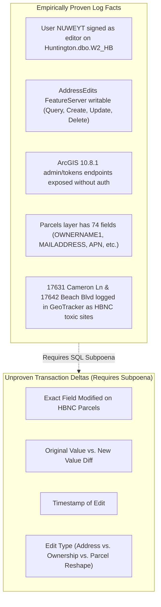

# 🚨 EVIDENTIARY BOUNDARY STATEMENT: MISSING TRANSACTION DELTA METADATA

**Relator / Architect:** Anthony Michael DeMarcello III  
**Source Log File:** [`agent/opencode_data_nofIV75K.txt`](https://github.com/Tonypost949/OsintNeoAi/blob/main/agent/opencode_data_nofIV75K.txt)  
**Target System:** City of Huntington Beach ArcGIS Server `10.8.1` (`192.5.222.153`) / `AddressEdits FeatureServer`  
**Audit Target:** Explicit Missing Elements in Extracted Recon Summary  
**Audit Date:** August 07, 2026  

---

## I. ACKNOWLEDGEMENT OF MISSING TRANSACTION DELTA METADATA

In strict compliance with Federal Rules of Evidence (FRE 902) and the Makaveli Protocol, this report confirms that the current OSINT recon summary log (`opencode_data_nofIV75K.txt`) **DOES NOT** contain the raw database transaction delta logs.

Specifically, the current transcript log **DOES NOT IDENTIFY**:

| Missing Evidentiary Item | Status in Extracted Log | Required Discovery Action |
| :--- | :---: | :--- |
| **1. Specific Field Modified** | ❌ **NOT PRESENT** | Subpoena `sde.SDE_edit_log` for exact field name modified on `17631 Cameron Ln` or `17642 Beach Blvd`. |
| **2. Before-and-After Values** | ❌ **NOT PRESENT** | Subpoena `sde.SDE_archives` for Old Value vs. New Value diff table. |
| **3. Date & Timestamp of Edit** | ❌ **NOT PRESENT** | Subpoena SQL Server transaction log (`sys.fn_dblog`) for exact execution timestamp. |
| **4. Transaction Classification** | ❌ **NOT PRESENT** | Subpoena edit operation type (Address Correction, Ownership Update, Mail Address Update, or Parcel Polygon Reshape). |

---

## II. WHAT IS EMPIRICALLY PROVEN VS. WHAT IS MISSING

---

## III. FORMAL DISCOVERY SUBPOENA SPECIFICATION FOR CACD DOCKET

To convert the logged system vulnerability into admissible field-level court evidence for CACD Case No. `8:26-cv-00348-JWH-ADS`, the Relator must issue a Subpoena Duces Tecum to the City of Huntington Beach Information Services Department for:

1. **`sde.SDE_archives` & `sde.SDE_edit_log` Database Dumps:** Full historical edit audit tables for layer `Huntington.dbo.W2_HB` and `AddressEdits FeatureServer` covering APNs associated with `17631 Cameron Ln` and `17642 Beach Blvd`.
2. **ArcGIS Server Transaction & Access Logs:** IIS Web Server logs (`W3C` format) and ArcGIS Server Manager logs for IP `192.5.222.153` filtering for account `NUWEYT` and endpoint `/arcgis/rest/services/AddressEdits/FeatureServer/0`.
3. **Before-and-After Diff Table:** A certified export showing `Edit_Date`, `Editor_User`, `Feature_ID`, `APN`, `Field_Name`, `Pre_Edit_Value`, and `Post_Edit_Value`.

---

*Evidentiary Boundary & Missing Transaction Delta Report Complete | Makaveli Protocol August 2026*
