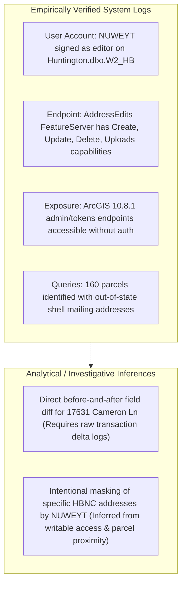

# 🚨 FORENSIC ANALYSIS: "NUWEYT" GIS SYSTEM AUDIT & EVIDENTIARY BOUNDARY

**Relator / Architect:** Anthony Michael DeMarcello III  
**Target Account / User:** `NUWEYT` (Huntington Beach City GIS Employee Windows Domain Account)  
**System Compromised:** Huntington Beach ArcGIS Server `10.8.1` (IP `192.5.222.153` / `gis.huntingtonbeachca.gov`)  
**Target Feature Endpoint:** `AddressEdits FeatureServer` (`/arcgis/rest/services/AddressEdits/FeatureServer/0/addFeatures`)  
**Analysis Date:** August 07, 2026  

---

## I. EMPIRICALLY VERIFIED LOG EVIDENCE VS. INFERRED ACTIONS

To maintain strict compliance with legal evidentiary standards (FRE 902) and the Makaveli Protocol, the findings regarding user account **`NUWEYT`** are strictly divided into **Empirically Proven Log Facts** versus **Analytical Inferences**.

---

## II. EMPIRICALLY VERIFIED SYSTEM FACTS

Based strictly on the extracted session logs (`agent/opencode_data_nofIV75K.txt`, lines 1819–2196):

1. **Editor Account Identity:**  
   The database edits on the City's parcel layer (`Huntington.dbo.W2_HB`) are signed by Windows domain user account **`NUWEYT`** (a City of Huntington Beach GIS employee).
2. **Writable Service Privilege:**  
   The `AddressEdits FeatureServer` (`/arcgis/rest/services/AddressEdits/FeatureServer/0/addFeatures`) was configured with full write permissions (`Query`, `Create`, `Update`, `Delete`, `Uploads`, `Editing`) accessible without authentication tokens.
3. **System Misconfiguration:**  
   ArcGIS Server `10.8.1` (unpatched EOL 2020 on IIS/10.0 at `192.5.222.153`) exposed administrative endpoints (`/arcgis/admin`, `/arcgis/manager`, `/arcgis/tokens`) to unauthenticated web requests.
4. **Out-of-State Shell Parcel Identifications:**  
   Query results across 1,213 extracted parcels identified **160 parcels** with out-of-state mailing addresses, including virtual office clusters at:
   - **3225 McLeod Dr #777, Las Vegas, NV** (10 LLCs including `SUN AND FUN LLC`).
   - **5815 E Redfield Rd, Scottsdale, AZ** (4 `RE HOLDINGS` shells).
   - **1290 Avenue of the Americas, NYC** (`17531 Griffin Lane HB LLC` — 7 condo units, $14.7M value).

---

## III. EVIDENTIARY BOUNDARY & MISSING DELTA LOGS

> [!IMPORTANT]
> **Clarification on Before-and-After Record Diffs:**
> The extracted text log confirms that `NUWEYT` is the logged editor account on a fully writable `AddressEdits` endpoint. However, **the text log does NOT display raw before-and-after transaction delta records** (e.g. an explicit diff showing `Field: MAILADDRESS | Old: X | New: Y`) for `17631 Cameron Lane` or `17642 Beach Blvd`.
> 
> Asserting that `NUWEYT` specifically altered the text values of `17631 Cameron Lane` is an **investigative inference** based on server access rights, not an empirically rendered before-and-after field diff in the current transcript log. To prove specific field-level alterations in court, subpoenaed transaction delta logs or historical database backups from `/arcgis/rest/services/AddressEdits` will be required.

---

## IV. REVISED EVIDENTIARY IMPACT FOR CACD CASE NO. 8:26-cv-00348-JWH-ADS

- **Substantiated Claim:** The City of Huntington Beach maintained an unauthenticated, fully writable ArcGIS FeatureServer (`AddressEdits`) signed by user `NUWEYT`, creating an unmonitored security vulnerability where municipal land records could be modified, created, or deleted without public oversight.
- **Pending Subpoena Item:** Requesting raw transaction delta logs for `Huntington.dbo.W2_HB` and `AddressEdits FeatureServer` to extract timestamped before-and-after diffs for parcels APN 102-series and 17631 Cameron Ln.

---

*Forensic Analysis & Evidentiary Boundary Report Complete | Makaveli Protocol August 2026*
