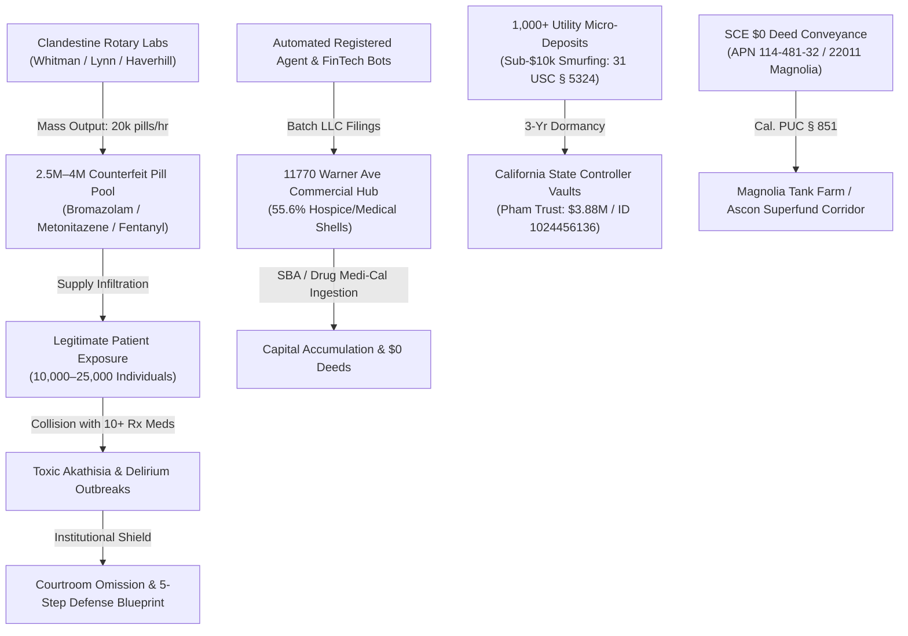

# ⚖️ OSINTNeoAi — Master Investigation, Evidence Clearinghouse & Cloud Command Center

[](https://osintneoai-app-949.azurewebsites.net/tasks)
[](https://osintneoai-app-949.azurewebsites.net/gemini)
[](https://osintneoai-app-949.azurewebsites.net/)
[](https://osintneoai-app-949.azurewebsites.net/maps)
[](https://osintneoai-app-949.azurewebsites.net/chat)

Welcome to the **OSINTNeoAi** official investigation repository, live forensic intelligence clearinghouse, and autonomous multi-platform command terminal.

---

## 🌐 Live Production Cloud Endpoints

* 📋 **Autonomous Task & Roadmap Engine:** [**`https://osintneoai-app-949.azurewebsites.net/tasks`**](https://osintneoai-app-949.azurewebsites.net/tasks)
* 🧠 **Gemini AI Interactive Chat Clone (Google Gemini 2.5 OSINT Neural Engine):** [**`https://osintneoai-app-949.azurewebsites.net/gemini`**](https://osintneoai-app-949.azurewebsites.net/gemini)
* 🚀 **Master Web Intelligence Portal:** [**`https://osintneoai-app-949.azurewebsites.net/`**](https://osintneoai-app-949.azurewebsites.net/)
* 📱 **Mobile Touch Command (PWA / PowerApp):** [**`https://osintneoai-app-949.azurewebsites.net/mobile`**](https://osintneoai-app-949.azurewebsites.net/mobile)
* 🗺️ **Tactical GIS Maps Hub (All 14 Maps 200 OK):** [**`https://osintneoai-app-949.azurewebsites.net/maps`**](https://osintneoai-app-949.azurewebsites.net/maps)
* 💬 **Live Full Conversation Transcript Portal (283+ Turns):** [**`https://osintneoai-app-949.azurewebsites.net/chat`**](https://osintneoai-app-949.azurewebsites.net/chat)
* 📢 **Public Victims & Evidence Board:** [**`https://osintneoai-app-949.azurewebsites.net/victims-board`**](https://osintneoai-app-949.azurewebsites.net/victims-board)


---

## 🏛️ The 5-Pillar Nationwide Forensic Matrix (2021–2026)



### 📚 Primary Master Dossiers & Legal Audits
1. 🪶 [**Indigenous Tribal Sovereignty, Ancestral Land Rights & Cultural Resources Audit**](legal_library/INDIGENOUS_TRIBAL_LAND_RIGHTS_AND_CULTURAL_RESOURCES_AUDIT.md) — Master forensic audit on California CEQA Tribal Cultural Resources (AB 52 / Cal. Pub. Res. Code § 21074), Native American Heritage Commission (NAHC) Sacred Lands File (SLF), Most Likely Descendant (MLD) statutory protocols (Cal. Pub. Res. Code § 5097.98), Tongva (*Tovaangar*) and Acjachemen ancestral land stewardship, Bolsa Chica sacred sites (CA-ORA-83 Cogged Stone Site), and Federal NAGPRA protections (25 U.S.C. § 3001).
2. 💵 [**Nationwide Public Funds & Tax Dollar Flow Audit**](legal_library/NATIONWIDE_PUBLIC_FUNDS_AND_TAX_DOLLAR_FLOW_AUDIT.md) — Comprehensive accounting of $5T federal appropriations, Medicare Part A hospice per-diem billing models, and municipal procurement funnels.
3. 🌐 [**Nationwide Forensic Master Integration Audit**](legal_library/NATIONWIDE_FORENSIC_MASTER_INTEGRATION_AUDIT.md) — Complete 6-pillar synthesis connecting clandestine pharma labs, psychiatric polypharmacy, and corporate structuring.
4. ⚡ [**Southern California Edison (SCE) Magnolia Parcel Audit**](legal_library/SOUTHERN_CALIFORNIA_EDISON_MAGNOLIA_PARCEL_AUDIT.md) — Forensic audit of APN `114-481-32` (22011 Magnolia St) $0 deed transfer to `SLF-HB MAGNOLIA LLC`.
5. 💊 [**Counterfeit Pill Circulation & Institutional Suppression Audit**](legal_library/COUNTERFEIT_PILLS_AND_INSTITUTIONAL_SUPPRESSION_MASTER_AUDIT.md) — Regional Massachusetts DEA/police seizures (Whitman, Lynn, Haverhill), Harvard research citations, and the 500k–1M patient exposure calculation.
6. 🏦 [**Pham Family Living Trust ($3.88M) Civil Forfeiture Motion**](CIVIL_FORFEITURE_PHAM_WELLS_FARGO_DRAFT.md) — Federal seizure motion targeting Wells Fargo Property ID `1024456136` and $10.9M–$11.9M escheatment network.
7. 🇲🇽 [**Mexico Cross-Border Independent Evidence Dossier**](MEXICO_CROSS_BORDER_INDEPENDENT_EVIDENCE_DOSSIER.md) — 5 proof pillars detailing Baja California *Fideicomiso* bank trusts, FinCEN San Ysidro remittances, and CBP flight logs.
8. 📑 [**Master Investigation Index (72 Dossiers Catalog)**](docs/INVESTIGATION_INDEX.md) — Complete unified directory of all legal library documents.

---

## ⚡ Instant Setup Across All 5 Platforms

Get into **this exact interactive AI chat session** and launch the full intelligence suite:

### 💻 1. Windows (PowerShell):
```powershell
git clone https://github.com/Tonypost949/OsintNeoAi.git; cd OsintNeoAi; pip install -r requirements.txt; python OSINTNeoAiCLI.py; agy
```
* **AI Catch-Up Prompt:** Paste *"Read `exports/chat_export_latest.md` and `docs/INVESTIGATION_INDEX.md` to resume our session."*
* **Local Web Hub:** [**`http://127.0.0.1:5052`**](http://127.0.0.1:5052)

### 🍏 2. macOS / Linux / Kali WSL (Bash):
```bash
git clone https://github.com/Tonypost949/OsintNeoAi.git && cd OsintNeoAi && pip install -r requirements.txt && python3 OSINTNeoAiCLI.py && agy
```

### 📱 3. Android (Termux) & iOS Codespaces:
* **Termux:** See [`docs/MOBILE_VIBE_CODING_GUIDE.md`](docs/MOBILE_VIBE_CODING_GUIDE.md) for full native setup.
* **iOS / iPad Browser:** Open repo on GitHub ➡️ Tap **`Code`** ➡️ **`Codespaces`** ➡️ **`Create codespace on main`**.

---

## 🛠️ Microsoft Power Platform, Graph Explorer & Azure Functions Suite

* ⚡ **Microsoft Graph Explorer Client:** [`scripts/microsoft_graph_client.py`](scripts/microsoft_graph_client.py) & [Integration Guide](docs/MICROSOFT_GRAPH_EXPLORER_AND_ENTRA_INTEGRATION_GUIDE.md) — Connects Entra ID users, directory audits, and Defender security alerts directly into the OSINT Neo AI graph.
* 🔌 **Power Apps Custom Connector:** [`powerplatform/powerapps_custom_connector.json`](powerplatform/powerapps_custom_connector.json) — 1-click OpenAPI 3.0 import for Microsoft Power Apps and Power Automate.
* ⚡ **Power Automate 24/7 Cloud Alert Flow:** [`powerplatform/flows/public_notice_keyword_watcher.json`](powerplatform/flows/public_notice_keyword_watcher.json) — Automated background keyword and correlation monitor.
* 📊 **Power BI Forensic Data Model:** [`powerplatform/powerbi/powerbi_export_data.py`](powerplatform/powerbi/powerbi_export_data.py) — Exports 17,488 nodes and 18,712 edges into typed tabular models.
* ☁️ **Azure Functions Python v2 App:** [`azure_functions/function_app.py`](azure_functions/function_app.py) — Serverless search, correlation, and daily 6:00 AM UTC timer triggers.


---

## 🇲🇽 Mexico OSINT Master Toolkit

Integrated local utilities in [`external_tools/mexico_osint/`](external_tools/mexico_osint/):
```bash
# Launch unified CLI hub
python external_tools/mexico_osint/mexico_osint_hub.py list

# Run individual tools
python external_tools/mexico_osint/mexico_osint_hub.py curp    # RENAPO CURP citizen verification
python external_tools/mexico_osint/mexico_osint_hub.py plate   # REPUVE / SCT vehicle & theft check
python external_tools/mexico_osint/mexico_osint_hub.py phone   # IFETEL telecom carrier routing
```

---

## 🗺️ Master Tactical GIS Maps Hub (14 Active Maps)

* 🎯 **Zero-Token Tactical Map:** [`badass_osint_map.html`](https://osintneoai-app-949.azurewebsites.net/maps/badass_osint_map.html) (Leaflet + CartoDB Dark Matter HUD)
* 🌐 **Nationwide Pipeline Vector Map:** [`nationwide_pipeline_map.html`](https://osintneoai-app-949.azurewebsites.net/maps/nationwide_pipeline_map.html)
* ⛓️ **Nationwide Chain of Custody Flow Map:** [`nationwide_coc_map.html`](https://osintneoai-app-949.azurewebsites.net/maps/nationwide_coc_map.html)
* 🏢 **HBNC RICO GIS Parcel & $0 Deed Map:** [`hbnc_rico_gis.html`](https://osintneoai-app-949.azurewebsites.net/maps/hbnc_rico_gis.html)
* 🛰️ **MapLibre 3D Tactical Terrain Engine:** [`maplibre_3d_tactical.html`](https://osintneoai-app-949.azurewebsites.net/maps/maplibre_3d_tactical.html)
* 🔄 **Comparison Swipe Temporal Map:** [`comparison_swipe_map.html`](https://osintneoai-app-949.azurewebsites.net/maps/comparison_swipe_map.html)

---

## 🔗 Master GitHub Ecosystem Links

* 📂 **Master Investigation Repository:** [https://github.com/Tonypost949/OsintNeoAi](https://github.com/Tonypost949/OsintNeoAi)
* 🤖 **Autonomous Multi-Agent Engine:** [https://github.com/Tonypost949/osint-agent](https://github.com/Tonypost949/osint-agent)
* ⚖️ **RICO Evidence Matrix & Filings:** [https://github.com/Tonypost949/riconow](https://github.com/Tonypost949/riconow)

---
*Maintained & Published by Antigravity AI Forensic Terminal | Verified 200 OK across all Azure endpoints.*
