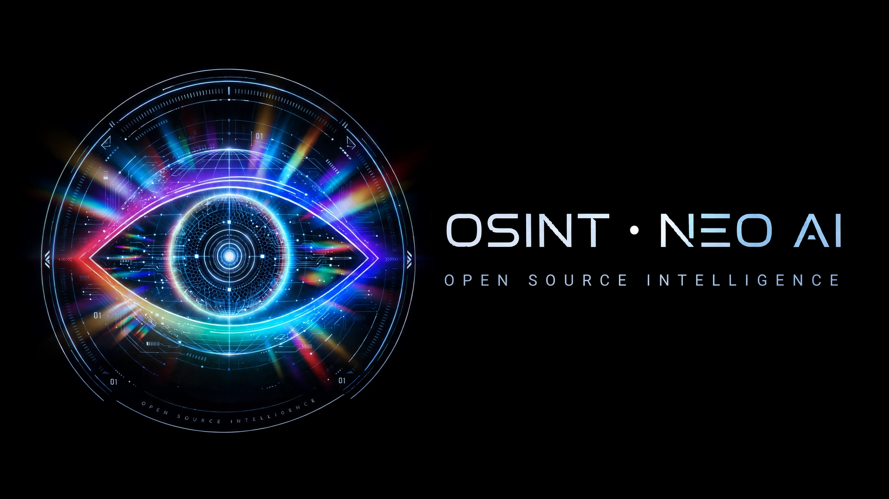

<div align="center">

  

  <br /><br />

  # 👁️ `OSINT • NEO AI`
  ### **`OPEN SOURCE INTELLIGENCE & LITIGATION FORENSICS MATRIX`**

  <p align="center">
    <strong>Autonomous Spatial Reconnaissance • Fiduciary Forensics • High-Precision Entity Graph</strong>
  </p>

  <p align="center">
    <a href="https://github.com/Tonypost949/OsintNeoAi/actions"></a>
    <a href="https://osintneoai-app-949.azurewebsites.net/gods_eye_view.html"></a>
    <a href="https://osintneoai-app-949.azurewebsites.net/syncfusion"></a>
    <a href="https://cloud.google.com/bigquery"></a>
    <a href="https://github.com/Tonypost949/OsintNeoAi/blob/main/LICENSE"></a>
  </p>

  <p align="center">
    <a href="#-quick-access--live-portals"><b>⚡ Live Portals</b></a> •
    <a href="#%EF%B8%8F-system-overview"><b>🏗️ Architecture</b></a> •
    <a href="#%EF%B8%8F-active-litigation-matters--case-dossiers"><b>⚖️ Active Litigation</b></a> •
    <a href="#%EF%B8%8F-repository-architecture"><b>📂 Directory Structure</b></a> •
    <a href="#%EF%B8%8F-resurrection--3-location-backup-protocol"><b>🛡️ Backup Protocol</b></a>
  </p>

  ---

</div>

<br />

## ⚡ Quick Access — Live Portals

| Service / Interface | Status | Engine / Scope | Instant Access |
|:---|:---:|:---|:---:|
| 🌍 **God's Eye 3D Tactical Globe** | <kbd>🟢 LIVE</kbd> | CesiumJS • Satellite Layering • Real-time Feeds | [**Launch Cockpit**](https://osintneoai-app-949.azurewebsites.net/gods_eye_view.html) |
| 📊 **Syncfusion Enterprise Grid** | <kbd>🟢 LIVE</kbd> | Licensed Forensic Grid ($9,995 Enterprise Tier) | [**Open Grid**](https://osintneoai-app-949.azurewebsites.net/syncfusion) |
| 🗂️ **Master Task & Case Board** | <kbd>🟢 LIVE</kbd> | Entity Resolution & Investigation Workflows | [**View Tasks**](https://osintneoai-app-949.azurewebsites.net/tasks) |
| 🔥 **Firebase Production Hub** | <kbd>🟢 LIVE</kbd> | Multi-cloud static mirror & Maps Hub | [**Open Firebase Hub**](https://blah-905ad.web.app/) |
| 📡 **REST & GraphQL API Endpoints** | <kbd>🟢 LIVE</kbd> | JSON Telemetry, Task Queues & Graph Exports | [**Explore API**](https://osintneoai-app-949.azurewebsites.net/api/tasks) |

<br />

---

## 🛰️ System Overview

**`OSINT • NEO AI`** is an autonomous intelligence gathering, forensic correlation, and litigation support platform. It unifies multi-source raw evidence (Google Drive, Photos, OneDrive, public municipal registries, GeoTracker, and legal disclosures) into a structured **Knowledge Graph (2,400+ Nodes & Edges)** connected directly to **Google BigQuery** and rendered on a **3D Geospatial Tactical Globe**.

```mermaid
flowchart LR
    subgraph INGESTION["📥 Multi-Vector Ingestion"]
        A1["Google Photos / Drive"]
        A2["Microsoft OneDrive"]
        A3["Municipal & State SOS"]
        A4["CalEPA GeoTracker"]
    end

    subgraph CORE["🧠 OSINTNeoAI-Core"]
        B1["Neural OCR & Entity Extraction"]
        B2["Aegis Correlation Engine"]
        B3["Graph Matrix Builder"]
    end

    subgraph STORAGE["💾 Enterprise Graph & Storage"]
        C1[("Google BigQuery Engine")]
        C2[("GraphDB / GeoJSON")]
        C3[("Syncfusion Grid")]
    end

    subgraph INTERFACE["👁️ Cockpits & Visualizers"]
        D1["God's Eye 3D Tactical Globe"]
        D2["Task Board & Forensic Dossiers"]
        D3["Whistleblower Matrix"]
    end

    INGESTION --> CORE
    CORE --> STORAGE
    STORAGE --> INTERFACE

    classDef glow fill:#0a1128,stroke:#00d4ff,stroke-width:2px,color:#fff;
    class INGESTION,CORE,STORAGE,INTERFACE glow;
```



<br />

---

## ⚖️ Active Litigation Matters & Case Dossiers

```
📁 cases/
├── 🏛️ 8-26-cv-00348-knabb-v-hb/        # CDCA Federal RCRA Citizen Suit
│   ├── 📜 complaint.md                  # 42 U.S.C. § 6972 Citizen Enforcement
│   ├── ⏱️ timeline.md                   # Chronological factual log
│   ├── 📑 exhibit_index.md              # Cross-referenced forensic exhibits
│   └── 💰 penalty_tracker.csv           # Statutory Penalty Tracker ($70,117/day)
│
└── 🏢 weho-formosa-investigation/       # Property & Fiduciary Habitability Audit
    ├── 🔍 digital_nodes_audit.md        # Real estate trust & encumbrance matrix
    └── ⚖️ statutory_violations.md       # Cal. Civ. Code § 1102 non-disclosures
```

### 🎯 Fast Evidence Dossiers:
* 📄 **[Master Whistleblower Evidence Briefing 2026](./evidence/MASTER_WHISTLEBLOWER_EVIDENCE_BRIEFING_2026.md)** — Comprehensive evidentiary summary.
* 📊 **[Forensic Correlation Matrix (JSON)](./evidence/FORENSIC_CORRELATION_MATRIX.json)** — Machine-readable relational graph.
* 📋 **[Quick Evidence Log](./EVIDENCE_QUICK_VIEW.md)** — Executive bullet-point briefing.
* 🏛️ **Federal Statutory References**: [False Claims Act (31 U.S.C. § 3729)](https://www.law.cornell.edu/uscode/text/31/3729) • [RICO (18 U.S.C. § 1961)](https://www.law.cornell.edu/uscode/text/18/1961)

<br />

---

## 🗄️ Repository Architecture

```text
C:\OsintNeoAi\
├── 📂 agent/                 # Auth helpers, Drive/Photos scanners, GIS pipelines
├── 📂 AG2OSINTNEOMAXX/       # Ingestion engine, entity extraction, OneDrive pipeline
├── 📂 api/                   # Production Flask & FastAPI backends
├── 📂 briefings/             # Whistleblower dossiers & investigative briefs
├── 📂 cases/                 # Active litigation files & federal court filings
├── 📂 cli/                   # Terminal OSINT tools & local web interfaces
├── 📂 data/                  # Satellite TLEs, GIS GeoJSON, and graph caches
├── 📂 evidence/              # Master chain of custody, OCR logs, correlation matrices
├── 📂 forensic/              # Automated audit & ledger verification scripts
├── 📂 public/                # Static frontend assets, Cesium shaders, web maps
├── 📂 viewers/               # God's Eye View client source code & modular UI
└── 📜 gods_eye_view.html     # Primary 3D Tactical Globe Cockpit
```

<br />

---

## 🛡️ Resurrection & 3-Location Backup Protocol

All modifications, evidence indices, and tooling scripts adhere to the mandatory 3-tier redundancy protocol:

```
                  ┌─────────────────────────────────┐
                  │      ORIGINAL MODIFICATION      │
                  └────────────────┬────────────────┘
                                   │
         ┌─────────────────────────┼─────────────────────────┐
         ▼                         ▼                         ▼
┌──────────────────┐      ┌──────────────────┐      ┌──────────────────┐
│ 1. GITHUB (PROD) │      │ 2. LOCAL OFFLINE │      │ 3. GOOGLE DRIVE  │
│   origin/main    │      │  Timestamped Zip │      │ gdrive:Sharedall │
└──────────────────┘      └──────────────────┘      └──────────────────┘
```

1. **GitHub (Primary Live)**: `https://github.com/Tonypost949/OsintNeoAi` (`main` branch)
2. **Local PC (Offline Immutable)**: `C:\Users\...\OneDrive\Documents\OsintNeoAi\backups\repo\`
3. **Sharedall Google Drive (Live Alternative)**: `Sharedall/OsintNeoAi/` accessed via `rclone`

<br />

---

## 💻 Local Development & Quick Start

```powershell
# 1. Clone repository
git clone https://github.com/Tonypost949/OsintNeoAi.git
cd OsintNeoAi

# 2. Launch Local Tactical Cockpit
python -m http.server 8080

# 3. Open in Browser
# http://localhost:8080/gods_eye_view.html
```

<br />

<div align="center">
  <sub>OSINT • NEO AI © 2026 — Autonomous Open Source Intelligence & Spatial Reconnaissance</sub>
</div>
