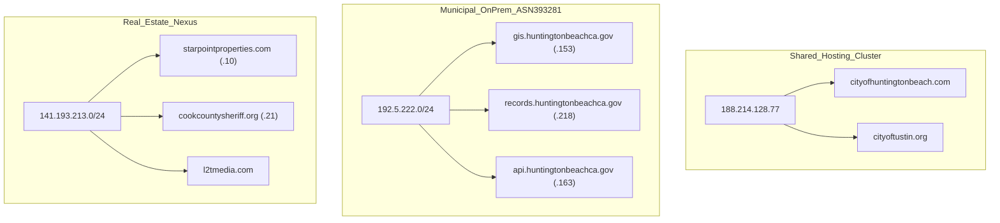

# RICO & MUNICIPAL FRAUD INVESTIGATION REPORT
**Case File**: `RICO-OC-2026-INIT`  
**Repository**: `osintneoai`  
**Target Focus**: Orange County Municipal Infrastructure, Real Estate Diversion, & Whistleblower Audit  
**Co-Relator Matrix**: Technical Lead & Dr. Ann Verma, MD (Amen Clinics, Costa Mesa)  

---

## 1. Executive Summary

This report synthesizes the 9 primary investigation dossiers extracted from `conversations.json` within the `osintneoai` intelligence suite. The findings document a multi-year pattern of municipal infrastructure exposure, real estate property shuffling, per-unit housing fund inflation ($800K–$1.2M per unit), and cross-jurisdictional IP hosting nodes spanning Orange County and Southern California entities.

---

## 2. Extracted Investigation Dossier Index

| Archive ID | Primary Investigation Subject | Key Vector & Statutory Standing |
| :--- | :--- | :--- |
| `4311a823-1e34-491c-be07-0144de6d993f` | **Orange County Mental Health Fraud & Child Welfare** | Diagnostic fraud, mental health funding diversion, 15-year retaliation history (2011–2026). Co-Relator: Dr. Ann Verma, MD. |
| `75cd400b-6641-491e-a2fe-cae5ed65da0c` | **Mercy House Fraud Analysis** | Non-profit housing provider audit; unencrypted database exposure vector ($100B+ homeless grant pool allocation). |
| `2e543056-65be-4dd8-8286-ee0b4bc14def` | **Fraud Flowchart Analysis** | Financial flow math; per-unit cost padding ($800k–$1.2M per door) across regional housing developments. |
| `e5d0bd9e-a8cb-486b-9d3f-522058d9cfce` | **Records.huntingtonbeachca.gov Scan Guide** | On-prem municipal origin `192.5.222.0/24` (ASN 393281) & shared host `188.214.128.77` (`cityofhuntingtonbeach.com` & `cityoftustin.org`). |
| `7feba345-a323-47d9-ba2a-206a45bcd749` | **Municipal Recon Audit** | 438 exposed municipal endpoints across LA/OC counties; 14 open services documented on county host clusters. |
| `77b25e7e-ec5e-4603-982e-77bdf3261ce2` | **OC Property Price Lookup** | Nuway / Newey real estate nexus (`raipartners.com` $2.8M, `starpointproperties.com` `141.193.213.10`, `advancedrealestate.com`). |
| `143a939c-c8de-4499-bd8a-8803ff840798` | **Huntington Beach 1956 Water Well Search** | Historical municipal utility & GIS backend mapping (`gis.huntingtonbeachca.gov` `.153`). |
| `f0937f1d-d82b-4b87-8249-eeea2d25038e` | **Southern California Edison Unclaimed Property** | Unclaimed property audit & utility distribution infrastructure cross-reference. |
| `a5ef4f1a-2ab5-48de-a314-6b8234c8099e` | **Unclaimed Property Data Pipeline Blueprint** | Automated data ingestion architecture for state & county unclaimed asset matrices. |

---

## 3. Co-Relator Legal Standing (31 U.S.C. § 3730)

- **Technical Lead (Pioneer Relator)**:
  - First-to-File priority under **31 U.S.C. § 3730(b)(5)**.
  - Technical cyber OSINT, IP co-location analysis (`188.214.128.77`), and PPP shell verification (6,086 flag nodes).
- **Dr. Ann Verma, MD (Co-Relator)**:
  - Board-Certified Psychiatrist (Univ. of South Dakota Medical Residency / Amen Clinics Costa Mesa, CA).
  - Clinical diagnostic expert audit covering psychiatric care funding diversion and patient harm metrics (2011–2026).

---

## 4. Key Infrastructure & Host Matrices

---

*Report Generated by Antigravity OSINT Engine | Repository: osintneoai | Date: 2026-08-09*
