# RICO NATIONWIDE INFRASTRUCTURE MATRIX

## Infrastructure Topology Diagram

```mermaid
graph TD
    subgraph Subnet_141_193_213 [Subnet Block: 141.193.213.0/24 - Host .21]
        A[libertyseniorliving.com]
        B["l2tmedia.com (RICO Shell)"]
        C["cookcountysheriff.org (Gov / Law Enforcement)"]
    end

    subgraph Host_3_33_130_190 [Single IP Host: 3.33.130.190]
        D[atlanticpacificcommunities.com]
        E[carlisledev.com]
        F["illuminationfoundation.org ($2M PPP Fraud)"]
    end

    subgraph Host_76_223_54_146 [Single IP Host: 76.223.54.146]
        G[libertyhomes.org]
        H[libertycare.com]
        I[libertycare.org]
        J["rbabuilders.com ($2.59M PPP Fraud)"]
    end

    subgraph Subnet_206_188_193 [Subnet Block: 206.188.193.0/24]
        K["stewartindustries.com (.48)"]
        L["cararlisledevelopment.com (.178)"]
    end

    subgraph Host_188_214_128_77 [Single IP Host: 188.214.128.77 - NO WAF]
        M2[cityofhuntingtonbeach.com]
        N2[cityoftustin.org]
    end

    subgraph Nuway_RealEstate_Cluster [Nuway / Newey Real Estate & Shell Network]
        P1["raipartners.com ($2.8M Property Shuffle)"]
        P2["starpointproperties.com (Subnet .10)"]
        P3["cmcleaning.com ($916K PPP Fraud)"]
    end

    A --- B
    B --- C
    D --- E
    E --- F
    G --- J
    H --- J
    I --- J
    K --- L
    M2 --- N2
    P1 --- P2
```

## Infrastructure Matrix Table

| CIDR / IP Address | Primary Domains | Shared / Co-located Infrastructure | Shell / Fraud Vector | Risk Level |
| :--- | :--- | :--- | :--- | :--- |
| `141.193.213.0/24` | `libertyseniorliving.com` | `cookcountysheriff.org` | `l2tmedia.com` | **CRITICAL**: Law enforcement IP subnet co-located with RICO shell entity. |
| `188.214.128.77` | `cityofhuntingtonbeach.com` | `cityoftustin.org` | Shared Cross-City Host | **HIGH**: 8 open ports (FTP/SSH/DNS/HTTP/POP3/IMAP) with zero WAF protection. |
| `192.5.222.0/24` | `huntingtonbeachca.gov` | `gis.huntingtonbeachca.gov`, `records.huntingtonbeachca.gov` | Municipal On-Prem Origin | **HIGH**: Unprotected ArcGIS & Laserfiche FOIA database exposure. |
| `198.202.211.1` | `raipartners.com` | Nuway / Newey Real Estate Nexus | $2.8M Property Transfer | **CRITICAL**: High-value real estate asset shuffle vector. |
| `3.33.130.190` | `atlanticpacificcommunities.com` | `carlisledev.com` | `illuminationfoundation.org` ($2M PPP) | **HIGH**: Real estate entity direct co-hosting with $2M PPP fraud target. |
| `76.223.54.146` | `libertyhomes.org`, `libertycare.com`, `libertycare.org` | Liberty Brand Cluster | `rbabuilders.com` ($2.59M PPP) | **CRITICAL**: Multi-domain Liberty umbrella hosted on single IP with $2.59M PPP fraud shell. |
| `206.188.193.0/24` | `stewartindustries.com` (.48) | `cararlisledevelopment.com` (.178) | Subnet Coupling | **MEDIUM**: Industrial & Development shared subnet infrastructure node. |

---

*Matrix Status: Updated & Synchronized with Intelligence Stream (2026-08-06)*
