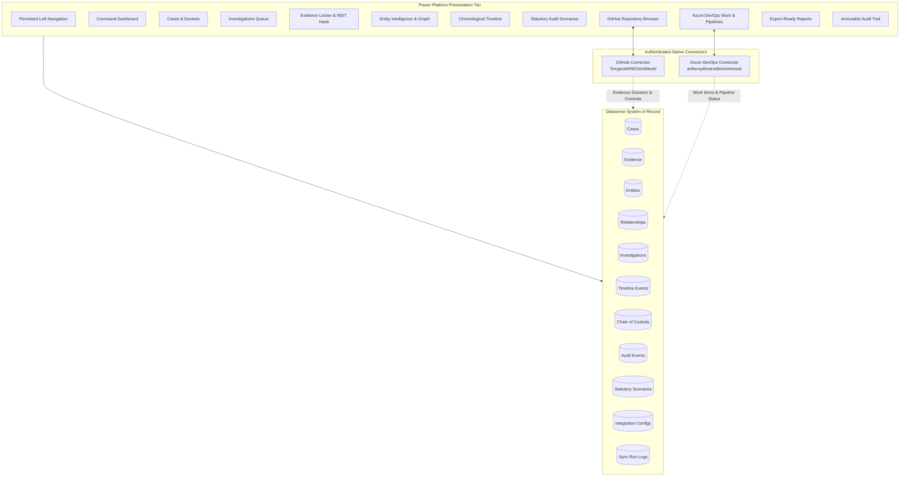

# 🏛️ OsintNeoAi Studio — Enterprise Power Platform Solution Specification
**Solution Name:** `OsintNeoAiStudio`  
**Publisher:** `OsintNeoAi` (`osintneoai`)  
**Target Environment:** Post University Microsoft Power Platform / Azure for Students  
**System of Record:** Microsoft Dataverse  
**Connected Ecosystems:** GitHub (`Tonypost949/OsintNeoAi`) & Azure DevOps (`anthonydimarcello/osintneoai`)  
**Target Version:** `1.0.0.0`  
**Classification:** Enterprise Forensic Intelligence & Legal Case Operations  

---

## 1. Executive Architecture Overview



---

## 2. Dataverse Entity Relationship Model (ERD)

### 2.1 Entity Catalog & Table Schemas

#### 1. `cr_cases` (Cases & Dockets)
* **Primary Name Column:** `cr_casename` (Single Line Text, Required)
* **Fields:**
  * `cr_caseid` (Unique Identifier, Primary Key)
  * `cr_casenumber` (Single Line Text, e.g., `8:23-cr-00108-CJC`, Indexed)
  * `cr_jurisdiction` (Choice: Federal District Court, CA Superior Court, NJ Superior Court, State Administrative Agency)
  * `cr_court` (Single Line Text, e.g., `USDC Central District of California - Santa Ana`)
  * `cr_status` (Choice: Active Discovery, Stayed, Disposed / Plea, Void Ab Initio, Appeal)
  * `cr_filingdate` (Date Only)
  * `cr_assignedinvestigator` (Lookup to `systemuser`)
  * `cr_notes` (Multiple Lines Text)

#### 2. `cr_evidence` (Evidence Locker)
* **Primary Name Column:** `cr_exhibitnumber` (Single Line Text, Required, Unique, Format: `EX-00001`)
* **Fields:**
  * `cr_evidenceid` (Unique Identifier, Primary Key)
  * `cr_evidencetype` (Choice: Court Filing, Wiretap Transcript, Regulatory Notice, Police Log, Invoice / Financial, Email Communication, Aerial / Photo)
  * `cr_description` (Multiple Lines Text)
  * `cr_sha256hash` (Single Line Text, 64-char Hexadecimal, Required for Verification)
  * `cr_custodian` (Single Line Text, e.g., `FBI SA Brian Adkins`, `Hamilton PD`, `Anthony DiMarcello`)
  * `cr_collectiondate` (Date and Time)
  * `cr_verificationstatus` (Choice: Unverified / Draft, Verification Pending, NIST Verified, Disputed)
  * `cr_sourceurl` (URL, e.g., GitHub raw URI or court portal link)
  * `cr_fileattachment` (File Column, Max 64MB)

#### 3. `cr_entities` (Entity Intelligence)
* **Primary Name Column:** `cr_entityname` (Single Line Text, Required)
* **Fields:**
  * `cr_entityid` (Unique Identifier, Primary Key)
  * `cr_entitytype` (Choice: Individual - Public Official, Individual - Consultant/Lobbyist, Shell LLC / Corporate, Non-Profit Organization, Municipal / Government Agency, Law Firm / Counsel)
  * `cr_riskscore` (Decimal Number, 0.0 to 100.0, Auto-Calculated)
  * `cr_riskbasis` (Multiple Lines Text, Contributing algorithmic factors)
  * `cr_description` (Multiple Lines Text)

#### 4. `cr_relationships` (Entity Network Edges)
* **Fields:**
  * `cr_relationshipid` (Unique Identifier, Primary Key)
  * `cr_sourceentityid` (Lookup to `cr_entities`, Required)
  * `cr_targetentityid` (Lookup to `cr_entities`, Required)
  * `cr_relationshiptype` (Choice: Bribery / Quid Pro Quo, Shell Ownership, Depository / Financial Conduit, Legal Representation, Subornation / Retaliation, Board Overlap)
  * `cr_notes` (Multiple Lines Text)

#### 5. `cr_investigations` (Work Streams & Priorities)
* **Primary Name Column:** `cr_investigationname` (Single Line Text, Required)
* **Fields:**
  * `cr_investigationid` (Unique Identifier, Primary Key)
  * `cr_caseid` (Lookup to `cr_cases`)
  * `cr_priority` (Choice: Critical / Tier 1, High / Tier 2, Medium, Low)
  * `cr_status` (Choice: Active Discovery, Matrix Compiled, Court Ready, Archived)
  * `cr_leadinvestigator` (Lookup to `systemuser`)
  * `cr_summary` (Multiple Lines Text)

#### 6. `cr_timelineevents` (Chronological Log)
* **Primary Name Column:** `cr_title` (Single Line Text, Required)
* **Fields:**
  * `cr_timelineeventid` (Unique Identifier, Primary Key)
  * `cr_investigationid` (Lookup to `cr_investigations`)
  * `cr_eventdatetime` (Date and Time, Required)
  * `cr_eventtype` (Choice: Intercepted Communication, Docket Filing, Lockout / Enforcement, Regulatory Notice, Bribery Offer, Corporate Transfer)
  * `cr_source` (Single Line Text)
  * `cr_evidenceid` (Lookup to `cr_evidence`, Optional)
  * `cr_description` (Multiple Lines Text)

#### 7. `cr_chainofcustodyevents` (Immutable Custody Ledger)
* **Fields:**
  * `cr_custodyeventid` (Unique Identifier, Primary Key)
  * `cr_evidenceid` (Lookup to `cr_evidence`, Required)
  * `cr_actor` (Lookup to `systemuser` or Single Line Text)
  * `cr_action` (Choice: Intake, Verification Executed, Transfer of Custody, Seal Modified, Export Generated)
  * `cr_timestamp` (Date and Time, System Populated)
  * `cr_witnessnotes` (Multiple Lines Text)

#### 8. `cr_statutoryauditscenarios` (Configurable Legal Models)
* **Primary Name Column:** `cr_scenarioname` (Single Line Text, Required)
* **Fields:**
  * `cr_scenarioid` (Unique Identifier, Primary Key)
  * `cr_authoritycited` (Single Line Text, e.g., `Cal. Gov. Code § 54230.5 (Surplus Land Act)`)
  * `cr_grossbaseamount` (Currency, e.g., `$320,000,000.00`)
  * `cr_statutoryrate` (Decimal, e.g., `30.00%`)
  * `cr_calculatedoutput` (Currency, e.g., `$96,000,000.00`)
  * `cr_assumptionsnotes` (Multiple Lines Text)
  * `cr_author` (Lookup to `systemuser`)
  * `cr_disclaimernotice` (Single Line Text, Default: `"ANALYTICAL MODEL ONLY — NOT FORMAL LEGAL ADVICE"`)

#### 9. `cr_integrationconfigs` & `cr_integrationsyncruns`
* Stores environment connection parameters (Org Name, Repo Slug, Target Branches, Sync Health, Timestamp, Error Logs). Zero plaintext secrets stored in Dataverse.

---

## 3. Native Connectors & Authentication Binding

### 3.1 GitHub Connector Configuration
* **Connection Reference:** `cr_conn_github_osintneoai`
* **Target Repository:** `Tonypost949/OsintNeoAi`
* **Bound Operations:**
  1. `GetRepositoryContent` — Read files from `briefings/` and `evidence/official_court_records/`.
  2. `ListCommits` — Stream latest commits from branch `main`.
  3. `CreateWorkflowDispatch` — Trigger GitHub Actions audit runs.

### 3.2 Azure DevOps Connector Configuration
* **Connection Reference:** `cr_conn_azdevops_osintneoai`
* **Organization:** `anthonydimarcello` (`https://dev.azure.com/anthonydimarcello`)
* **Project:** `osintneoai`
* **Bound Operations:**
  1. `GetWorkItems` — Sync investigative backlog items and sprint milestones.
  2. `ListBuilds` / `GetPipelineRuns` — Monitor repository validation pipelines.
  3. `GetAuditLogs` — Pull project telemetry and service events.

---

## 4. UI/UX Architecture & Dark Cyber-Forensic Theme

### Color Palette & Token Hierarchy
```json
{
  "theme": "Dark Cyber-Forensic",
  "palette": {
    "backgroundPrimary": "#0A0D14",
    "backgroundSurface": "#121824",
    "backgroundElevated": "#1A2233",
    "borderSubtle": "#253147",
    "borderFocus": "#00E5FF",
    "textPrimary": "#F0F4F8",
    "textSecondary": "#94A3B8",
    "accentCyan": "#00E5FF",
    "accentGreenVerified": "#10B981",
    "accentAmberWarning": "#F59E0B",
    "accentRedCritical": "#EF4444"
  }
}
```

### Navigation Structure
```text
├── 📊 Command Dashboard (KPIs, Exposure Counters, Live Velocity)
├── ⚖️ Cases & Dockets (Searchable Register & Judicial Meta)
├── 🎯 Investigations (Tier 1 Priorities & Task Work Queues)
├── 🔒 Evidence Locker (NIST SHA-256 Verifier & Custody Ledger)
├── 🕸️ Entity Intelligence (Multi-Tier Risk Graph & Relationship Explorer)
├── ⏱️ Timeline & ROA (Second-by-Second Procedural Timeline)
├── 📜 Legal Analysis (Configurable Statutory Audit & Qui Tam Models)
├── 🐙 GitHub Hub (Live Commits, Briefing Reader & Dossiers)
├── ⚡ Azure DevOps (Work Items, Pipelines & Build Telemetry)
├── 📑 Reports & Dossiers (Export-Ready Court Packages & PDF Gen)
└── 🛡️ Audit Trail (Immutable System Activity Logs)
```

---

## 5. Automated Validation & Business Rules

### Rule 1: 64-Character SHA-256 Hex Verification
```powerfx
// Power Fx validation rule on cr_evidence form
If(
    cr_verificationstatus = 'cr_verificationstatus'.NISTVerified,
    If(
        IsMatch(Self.Text, "^[a-fA-F0-9]{64}$"),
        Notify("SHA-256 Hash Cryptographically Validated", NotificationType.Success),
        Error("Verification Failed: Hash must be a valid 64-character hexadecimal SHA-256 string.")
    )
)
```

### Rule 2: Auto-Generated Exhibit Numbering
```powerfx
// Generate sequential exhibit IDs upon creation
Concatenate("EX-", Text(CountRows(cr_evidences) + 1, "00000"))
```

### Rule 3: Entity Risk Scoring Algorithm
$$\text{Risk Score} = \min\left(100, (\text{Predicate Acts} \times 25) + (\text{Shell Links} \times 15) + (\text{Government Subpoena/Plea} \times 30)\right)$$

---

---

## 6. AI Provenance Standard & Workspace Isolation Architecture

### 6.1 Objective AI Reasoning Standard (Zero Subjective Bias)
* **Algorithmic Provenance**: All factual claims, entity links, mathematical penalties, and graph edges are derived deterministically by AI models from primary source documents (court filings, certified police logs, official regulatory notices, bank records, and authenticated photographs).
* **Source Transparency**: No finding represents personal opinion; each node explicitly references its underlying judicial docket number, issuing agency citation, or NIST SHA-256 evidence hash.
* **Non-Legal Advice Notice**: All statutory models and qui tam recovery ranges are labeled as automated heuristic scenarios for analytical purposes.

### 6.2 Modular Workspace Isolation & Investigation Modes

```text
┌────────────────────────────────────────────────────────────────────────────────┐
│                          OSINTNEOAI STUDIO WORKSPACE MODES                      │
├────────────────────────────────────────────────────────────────────────────────┤
│ [MODE A] Benchmark Reference Investigation (DiMarcello / Anaheim Cabal)         │
│   • Pre-seeded reference dataset demonstrating full-cycle pipeline capabilities │
│   • Tagged with is_sample_data: true for clear segregation                      │
├────────────────────────────────────────────────────────────────────────────────┤
│ [MODE B] Clean-Slate Independent Investigation Workspace                        │
│   • Spin up brand-new investigations with ZERO pre-existing author data         │
│   • All forensic tools, OCR pipelines, schemas, and connectors at default state │
├────────────────────────────────────────────────────────────────────────────────┤
│ [MODE C] Fork / Continuation with Automated Author Telemetry                    │
│   • External investigators can fork or build upon the reference investigation   │
│   • Dispatches real-time telemetry alert & audit log to admin dashboard        │
├────────────────────────────────────────────────────────────────────────────────┤
│ [MODE D] Safe Data-Layer Purge (Tool & Workflow Preservation)                   │
│   • One-click wipe of investigative data records without resetting tools        │
│   • Preserves Dataverse schemas, Power Fx rules, connectors, and workflows      │
└────────────────────────────────────────────────────────────────────────────────┘
```

#### Detailed Mode Operations:
1. **Mode A: Seeded Reference / Benchmark Investigation**:
   - The DiMarcello / Anaheim Municipal Cabal / 11770 Warner matter serves as the packaged reference investigation.
   - All sample records carry the system tag `cr_issampledata = true` to prevent co-mingling with new user investigations.
2. **Mode B: Clean Slate Workspace**:
   - An investigator can initialize a blank workspace. The entire pipeline (neural OCR, entity extraction, NIST SHA-256 verifiers, and Power Platform connectors) starts fresh with empty tables.
3. **Mode C: Continuation & Telemetry Alerting**:
   - If an external user clones or continues the reference investigation, a Power Automate flow triggers an automated event in `cr_auditevents` and sends a webhook/notification alert to the solution owner (`anthony.dimarcello@students.post.edu`).
4. **Mode D: Safe Purge (Tool Retention)**:
   - Provides a controlled administrative action: `Purge Investigation Data`.
   - Clears record rows in `cr_cases`, `cr_evidence`, `cr_entities`, and `cr_relationships` while leaving all connectors, UI forms, Dataverse table definitions, and automation flows 100% operational.

---

## 7. Seed Data: Canonical Court Matters & Scenarios

| Case ID | Docket Number | Case Caption & Court | Key Statutory Exposure | Sample Tag |
| :--- | :--- | :--- | :--- | :---: |
| **`CASE-001`** | `8:23-cr-00108-CJC` | *USA v. Harry Sidhu* (USDC C.D. Cal.) | 18 U.S.C. §§ 1343, 1519, 1001 (54 Yrs Max, $320M Land Deal) | `REFERENCE` |
| **`CASE-002`** | `8:22-cr-00078-CJC` | *USA v. Todd Ament* (USDC C.D. Cal.) | 18 U.S.C. §§ 1343, 1014, 26 U.S.C. § 7206(1) ($225k Slush Wire Fraud) | `REFERENCE` |
| **`CASE-003`** | `3:20-mj-05007-TJB` | *USA v. Christopher Ryan* (USDC D.N.J.) | 21 U.S.C. §§ 841(a)(1), 841(b)(1)(A) (435g Meth Assay, DEA Northeast) | `REFERENCE` |
| **`CASE-004`** | `30-2021-01201327-CL-UD-CJC` | *Woodbridge Meadows v. Dimarcello* (OC Superior Court) | Triple Void Defaults, Cal. CCP § 170.6 Strike, Cal. Civ. Code § 1942.5 | `REFERENCE` |

---

## 8. Step-by-Step Deployment Instructions

1. **Sign into Power Apps**:
   - Access **[make.powerapps.com](https://make.powerapps.com)** using `anthony.dimarcello@students.post.edu`.
2. **Create Dataverse Solution**:
   - Navigate to **Solutions** ➔ Click **New Solution** ➔ Display Name: `OsintNeoAi Studio` ➔ Publisher: `OsintNeoAi`.
3. **Bind Connectors**:
   - Go to **Connections** ➔ Add **GitHub** (Authorize `Tonypost949`) ➔ Add **Azure DevOps** (Organization `anthonydimarcello`).
4. **Configure Workspace Mode**:
   - Select either **Seeded Reference Mode** (loads the 4 canonical cases) or **Clean Slate Mode** (empty workspace).
5. **Publish & Assign Roles**:
   - Assign `OsintNeoAi Administrator` or `Lead Investigator` role to student profile.

