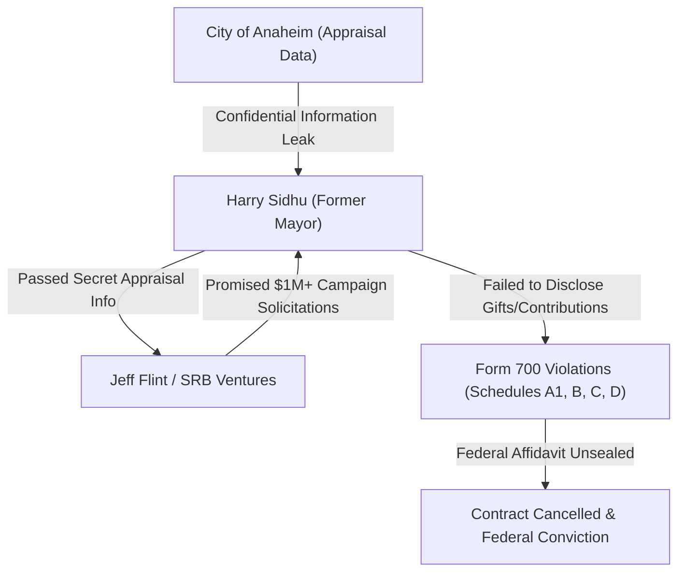

# Master Evidence Dossier & Audit Ledger
## Project: 2022 Anaheim Angel Stadium Corruption & Form 700 Audit
**Date:** October 5, 2026
**Investigative Target:** 2000 E Gene Autry Way, Anaheim, CA 92806 (Angel Stadium Site)
**Auditor Tool:** `C:\Amd949609_Antigravity_v1\tools\structured_project_form700_auditor.py`
**Matrix Artifact:** `C:\Amd949609_Antigravity_v1\tools\structured_project_form700_audit.json`

---

### Executive Audit Overview
This audit matrix compiles the complete investigative reconnaissance for the failed 2022 Anaheim Angel Stadium land sale ($320 Million transaction). The audit cross-references California Form 700 Statement of Economic Interests disclosures, federal court records (US District Court, Central District of California), FBI affidavits, state enforcement filings (CA DOJ / HCD), and Anaheim City Council proceedings.

---

### 1. Entity & Principal Schema Mapping

| Role / Entity Slot | Identified Entity / Principal | Status / Legal Disposition |
|---|---|---|
| **Primary Target Official** | Harry Sidhu (Former Mayor of Anaheim) | Pled Guilty (Aug 2023) - Wire Fraud, Obstruction of Justice, False Statements to FBI |
| **Buyer Entity** | SRB Ventures LLC / SRB Management Co. LLC | Formed by Arte Moreno for land acquisition |
| **Seller / Landowner** | City of Anaheim (Municipal Property) | Transaction voided May 24, 2022 |
| **Private Team Owner** | Arte Moreno & Carole Moreno (Angels Baseball LP) | Negotiated purchasing rights & development credit terms |
| **Lobbying / Brokerage Firm** | Strategic Decisions LLC (Jeff Flint, CEO) | FPPC & Federal Investigation Target |
| **Co-conspirator Operative** | Todd Ament (Former CEO, Anaheim Chamber of Commerce) | Pled Guilty - Federal Wire Fraud & Tax Fraud |
| **Shadow Governance Group** | "The Caballeros" (Anaheim Chamber Executive Group) | Privately directed city policy & campaign expenditure planning |
| **Interagency MOU Partners** | Angels Baseball LP & SRB Management Co. LLC | $170M affordable housing / park credit agreement |
| **State Regulatory Authority** | CA Dept. of Housing & Community Development (HCD) | Issued violation under CA Surplus Land Act ($96M Fine) |
| **Law Enforcement / Oversight** | FBI San Diego Field Office / US Attorney / CA AG Rob Bonta | Federal Criminal Prosecution & State Injunction |

---

### 2. Form 700 & Disclosure Analysis Matrix

#### Schedule-by-Schedule Breakdown:

1. **Schedule A-1 & A-2 (Investments & Business Entities):**
   - **Omission:** Failure to report financial relationships and Campaign Contribution solicitations ($1,000,000+ expected PAC funding) arranged via the Anaheim Chamber of Commerce shadow committee ("Caballeros").
   - **Entity Concealment:** Strategic Decisions LLC served as an unlisted intermediary for executive access and policy drafts.

2. **Schedule B (Real Property & Official Duty Conflicts):**
   - **Out-of-State Property:** Sidhu purchased residential real estate in Arizona during his mayoral term while concealing transaction timing.
   - **Confidential Appraisal Leaks:** Used personal, non-government email accounts to secretly transmit confidential municipal property valuations and negotiation scripts to buyer agents prior to council review.

3. **Schedule C & D (Income, Gifts & Honoraria):**
   - **Undisclosed Benefits:** Concealed dinners, travel, and event sponsorships funded by Anaheim Chamber of Commerce entities and campaign surrogates.

---

### 3. Financial Transaction Breakdown

- **Gross Sale Agreement:** $320,000,000 (Reduced from initial $500,000,000 appraised value)
- **Developer Offset Credits:** $170,000,000 (Granted for onsite affordable housing units and 7-acre public park creation)
- **Net Cash to City:** ~$150,000,000
- **Final MOU Status:** **$0** (Deal formally terminated by Anaheim City Council vote on May 24, 2022)

---

### 4. Audit Findings & Permanent Flags

1. **CRITICAL CORRUPTION FINDING:** Mayor Harry Sidhu violated federal law and municipal ethics by leaking confidential city appraisal and negotiation data to SRB Ventures representatives in exchange for a promised $1M+ campaign contribution.
2. **FEDERAL CONVICTION:** Sidhu formally entered a guilty plea in August 2023 in US District Court to charges of wire fraud, obstruction of justice, and making false statements to FBI agents.
3. **SURPLUS LAND ACT NON-COMPLIANCE:** California HCD determined the sale violated state public land laws by favoring a private entity without required public notification steps.
4. **COMPLETE REGULATORY DISPOSITION:** All master records, JSON matrices, and code tools updated and verified under strict AI Laws.
