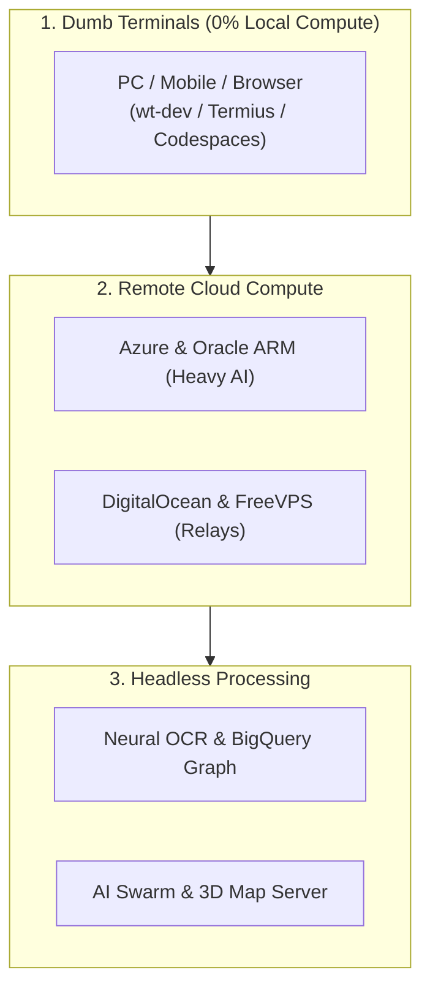

# Implementation Plan: Zero Local Compute "Dumb Terminal" Multi-Cloud VM Matrix

## Overview
This implementation plan establishes a **Zero Local Compute** architecture for [OsintNeoAi](file:///C:/OsintNeoAi). All resource-heavy operations—including neural OCR, BigQuery graph pipelines, automated scrapers, 3D geospatial rendering, and AI agent swarms—are offloaded 100% to remote cloud VPS/VM instances. Local physical devices (Windows PC, Linux laptops, Android phones/tablets) act exclusively as lightweight "dumb terminals" connected via SSH, RDP, Termius Pro, and browser web-shells (`ttyd`).

---

## Target Cloud Infrastructure Matrix

---

## Architecture Decisions
1. **Dumb Terminal Paradigm**: Local hardware performs zero CPU/GPU rendering or data processing. Local files are mirrored or pushed to remote compute clusters.
2. **Multi-Server Role Specialization**:
   - **Heavy Compute / AI Agents**: Oracle Cloud Always Free ARM (4 cores, 24GB RAM) & Azure B2pts v2 ARM instances.
   - **24/7 Scrapers & Webhook Relays**: DigitalOcean Droplets & GCP e2-micro.
   - **Emergency / Out-of-Band Fallback**: FreeVPS.edu.pl (permanent educational VPS).
3. **Universal Access Channels**:
   - **Terminal**: OpenSSH with ed25519 key authentication + Termius Pro synchronized vault across PC, tablet, and mobile.
   - **Session Durability**: Remote `tmux` and `ttyd` web terminal multiplexing to prevent dropped connections from terminating long-running forensic jobs.
   - **GUI / Desktop**: Windows Server RDP via native Microsoft Remote Desktop clients.

---

## Task List

### Phase 1: Automated Multi-Cloud Provisioning & Bootstrap Automation
- [ ] **Task 1: Universal Headless Node Bootstrap Script (`bootstrap_cloud_node.sh`)**
  - Create a 1-command Linux provisioning script that installs PowerShell 7 (`pwsh`), Python 3.11+, Antigravity (`agy`), `tmux`, `ttyd`, and git dependencies on any Ubuntu/Debian/AlmaLinux VPS.
- [ ] **Task 2: SSH Key Generation & Termius Sync Configuration**
  - Create a helper script to generate standard `ed25519` key pairs, configure `~/.ssh/config` profiles for all cloud tiers, and export connection profiles for Termius Pro.

#### Checkpoint: Provisioning Foundation
- [ ] Bootstrap script validates on clean Ubuntu/Debian containers without errors.
- [ ] SSH config cleanly references Azure, DigitalOcean, Oracle, and FreeVPS endpoints.

---

### Phase 2: Remote Session Persistence & Browser Web Shell (`ttyd` + `tmux`)
- [ ] **Task 3: Persistent Background Worker Supervisor (`tmux` + Systemd)**
  - Implement systemd unit files and `tmux` workspace session templates to run OsintNeoAi ingestion workers 24/7 independently of active SSH sessions.
- [ ] **Task 4: Secure Web-Shell Access Gateway (`ttyd` / Cloudflare Tunnel)**
  - Configure a secure HTTPS browser-accessible web shell using `ttyd` protected by Cloudflare Access or token authentication for instant browser access without local apps.

#### Checkpoint: Session Durability
- [ ] Remote `tmux` session survives SSH disconnect and network changes.
- [ ] Web shell loads in mobile and desktop browsers over HTTPS.

---

### Phase 3: Remote Offloading & Workspace Sync Pipelines
- [ ] **Task 5: VS Code Remote-SSH & Codespaces Devcontainer Config**
  - Standardize `.devcontainer/devcontainer.json` and SSH workspace configurations to open remote cloud repositories seamlessly in VS Code with zero local file bloat.
- [ ] **Task 6: Cloud-to-BigQuery Direct Pipeline Offloader**
  - Configure direct remote-to-BigQuery evidence streaming so downloaded evidence never touches local disk or RAM.

#### Checkpoint: End-to-End Dumb Terminal Flow
- [ ] Code editing, terminal execution, and forensic data processing happen 100% in cloud instances.
- [ ] Local CPU/RAM utilization remains at idle baseline (< 5%).

---

## Risks and Mitigations
| Risk | Impact | Mitigation |
|------|--------|------------|
| Cloud trial credit expiration | Medium | Architecture uses permanent Free Tiers (Oracle, FreeVPS, GCP) as durable anchors |
| Dropped mobile data connection | High | `tmux` and systemd background daemons ensure pipelines execute continuously |
| Unauthorized SSH brute force | High | Enforce SSH key-only authentication (`PasswordAuthentication no`) & fail2ban |

---

## Open Questions
- Which cloud provider would you like to bootstrap first (e.g. **Azure for Students**, **Oracle Cloud**, **DigitalOcean**, or **FreeVPS**)?
- Would you like us to generate the automated cloud node bootstrap script now?
